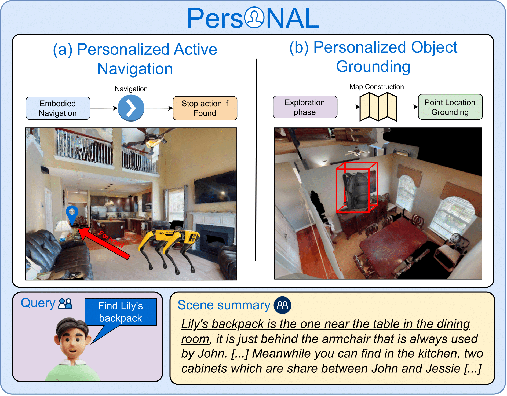

# PersONAL: Personalized Object Navigation And Localization

This repository will host the **code** and **dataset** for the paper:

**PersONAL: Towards a Comprehensive Benchmark for Personalized Embodied Agents**

---

## 📄 Paper
- [arXiv preprint](https://arxiv.org/abs/2509.19843)  

<p align="center">
  
</p>

---

## 📢 Updates
- The dataset is available on the `data` folder 🚀  
- The dataset Generation code is available on the `dataset_generation` folder. 🚀  
- Baseline Codes and new features will be released soon. Stay tuned! 🚀  
- Please consider starring ⭐ this repository to receive the latest updates.

---

## Evaluating Baselines

For guidelines to set up the PersONAL dataset, and evaluate the baselines, please refer to the `baselines` branch. 

## 📑 Citation
If you find this work useful, please cite:

```bibtex
@article{ziliotto2025personal,
  title   = {PersONAL: Towards a Comprehensive Benchmark for Personalized Embodied Agents},
  author  = {Filippo Ziliotto and Jelin Raphael Akkara and Alessandro Daniele and Lamberto Ballan and Luciano Serafini and Tommaso Campari},
  journal = {arXiv preprint arXiv:2509.19843},
  year    = {2025}
}
